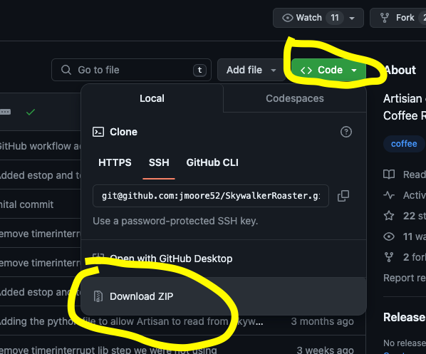
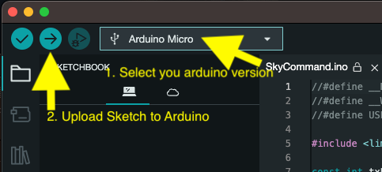
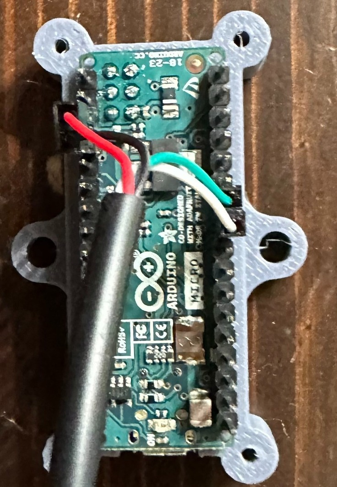
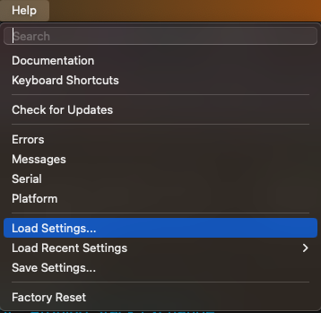
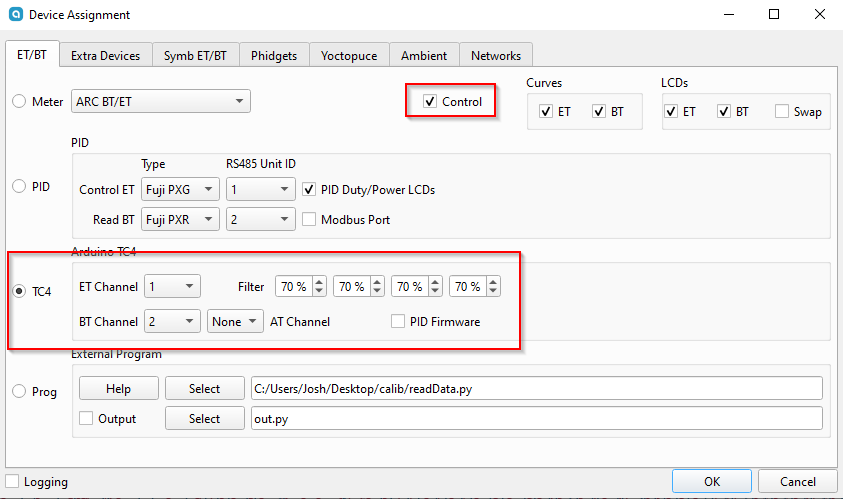
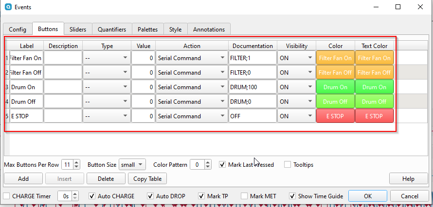
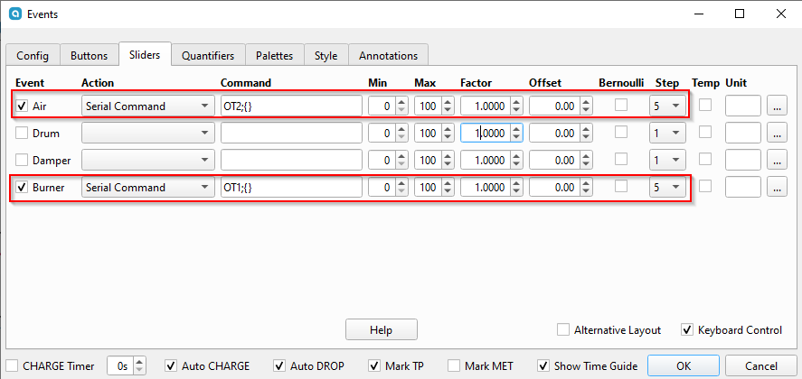

# Skywalker Roaster

This is a guide to for connecting the Skywalker/ITOP MTCR(SkItop) Roaster connected to Artisan. In addition to the arduino sketches the data I've collected about the roaster is available here.

⚠️WARNING 👉 DO NOT LEAVE ROASTER UNATTENDED⚠️

The easiest way to get this working is to
1. Connect USB cable to [Arduino](#arduino-instructions) with correct jumpers
2. Load [Sketch](#arduino-instructions) onto arduino
3. Load [config[](#artisan-upload-config) into artisan-scope
4. Plug in arduino to computer through arduino USB cable(NOT the one we jumpered)
5. Plug in arduino to roaster where the controller was connected with the USB cable we jumpered
6. In artisan [config](#artisan-manually-setting-config) set the correct device
7. click/tap the on button in artisan-scope and temps should be available and roaster is controllable
   
## Arduino Sketches

### SkyCommand
This is full control of the skywalker roaster via Artisan. The sketch does the bare minimum to emulate TC4. Exercise caution, there are minimal safety features built in. As with every other coffee roaster..

⚠️WARNING 👉 DO NOT LEAVE ROASTER UNATTENDED⚠️

The sketch requires that it see a command from Artisan at least every 10 seconds or it will shut down. The READ commands from artisan will keep it going. I think it's ok to run, but what do I know? I'm just a nerd on the internet. Use this at your own risk.

#### Hardware
I use an arduino leonardo with a USB cable soldered to the Vin, GND, and Digital Pins 2 and 3. That's it.


The black cable goes to the USB port on the back of the roaster (that's only USB in form.. it's not actually using USB communications), the white one to my computer running Artisan.

## Arduino Instructions

1. Install ArduinoIDE

2. Find any old USB cable. Cut it up in half, and prune a bit off the plastic sleeving. You should find four smaller wires. Connect these wires to your Arduino as such either through soldering or just inserting it into the slots:

      Green -> Digital 2  
      White -> Digital 3  
      Red -> VIN  
      Black -> GND

    Breadboard example:
   
    

    Soldering example (more secure):
   
    
    
    
3. Download repository and extract.


1. Connect your Arduino into your computer.

    

2. Go to your SkywalkerRoaster-main folder that you extracted. Click on the SkyCommand folder then double click on `SkyCommand.ino` (should open automatically in ArduinoIDE)

3. Click on the check mark to do a precompile, this lets you know if the code will work on your board.
4.  Click on your Arduino device and press Upload, the console on the bottomr should give you a success message. Some boards output debug, but if there is no error it probably succeeded.


## Hardware Pinout Examples
Arduino Micro
<!--  -->


## Artisan Upload Config
We can upload a preset config in Artisan Scope
Help -> Load Settings...


This is a default file with the most basic settings.
[basic-skitop-artisan-settings.aset](ArtisanConfigs/basic-skitop-artisan-settings.aset)

look in [ArtisanConfigs](ArtisanConfigs/) for other configs users have created.


## Artisan Manually Setting Config
Here's how I have Artisan configured.
Config -> Device


After pressing OK, an additional dialogue box will appear, select your Arduino. If you're not sure which is your Arduino, disconnect and reconnect it and the dialogue box should change.
You can also navigate here by going to Config -> Port...
Comm Port will be different depending on OS you are running and which USB port you are plugged into.


Config -> Events -> Config

```
DRUM;100
```

Config -> Events -> Buttons

```
DRUM;100
```
```
DRUM;0
```
```
FILTER;1
```
etc..

Config -> Events -> Sliders

```
OT2;{}
```
```
OT1;{}
```
### Troubleshooting
- check all connections, unplug and re-plug in the USB cables, also check pins and solder points
- swap out USB cables, the arduino to computer cable is important also
- you will need to have drivers for your arduino unit on some machines so if you're running on a different machine where you set up the arduino, just install arduino IDE and install the drivers with the IDE to ensure you can connect
- make sure you are on the tested or later version of artisan

### Testing/Compatibility
#### Artisan Version
- 2.10.2
#### Working Hardware Combos
- Leonardo
  - Windows ?
- Micro
  - Windows 11
  - MacOS
- Nano ATMEGA
  - Linux Mint

- Uno Wifi R4
  - not yet

### SkywalkerSpy
This provides logging only for Artisan. It uses two pins to monitor the Tx lines from both the roaster and the controller. It alternates between reading the values as quickly as possible. When any input comes in on the serial line the sketch will respond with the status of the roaster in the format TEMP,HEAT DUTY,VENT DUTY

## Roaster Hardware
This has been super fun to study. Here's what I've learned so far.

The controller has a [js32t031f5s7 microcontoller](http://www.honor-ic.com/Product/ProScreenDetail?pid=118).

I am unsure what kind of microcontroller is inside the roaster. It is marked FMD N3hWIKH and I was unable to locate any datasheets for it.


The roaster uses a thermistor as a temperature probe which is connected to the microcontroller as shown here.


It appears to use a voltage divider with two taps, one passing through a 1k resistor and the other through a 2k resistor. I'm not the strongest hardware guy by any means, but I don't understand why. If this look familiar to you, please let me know what we're looking at here.


### Normal Operation
The Skywalker roaster is rather simple all logic lives in the controller. The roaster simply interprets the signals sent by the controller and sets things accordingly. The roaster appears to shut down if it does not receive a control message in 1 second. The controller reads the temperature values from the roaster and then sends instructions to the roaster. There does not appear to be any kind of communications protocol, each device appears to send messages to the other device roughly every 10 milliseconds. There are no requests, responses, acknowledgements, etc..  Simply data bit banged on a GPIO line.

## Messages
The messages sent by each device are rather simple in structure. I've determined what most everything does. To the logic analyzer, the messages appear as follows. This is an example of the message the roaster sends. The controller's messages look identical other than being 8 bits shorter.


Interpreting the messages can be done by simply measuring the logic LOW pulses. The beginning preamble is roughly 7.5ms, a binary 1 is represented by a ~1.5ms pulse, a binary 0 is ~600 microseconds, and the logic HIGH between bits is roughly 750 microseconds.


### Controller
The controller transmits a 6 byte message in LSB order. Both messages contain a checksum and will be ignored if the checksum is not correct.

| Position | Purpose | Value |
|----------|---------|-------|
| 0 | Fan Duty Cycle | 0 to 100
| 1 | Filter | Appears to only be values 0,1,2,3,4 |
| 2 | Bean Cooling Fan | 0 or 100 |
| 3 | Drum | 0 or 100 |
| 4 | Heater Duty Cylce | 0 to 100 |
| 5 | Checksum | |

For the Fan and Heater, duty cycles increment by 5. Sending other values will be ignored.

### Roaster
The roaster transmits a 7 byte message in LSB Order.
|Position| Name| Value|
|--------|-----|------|
|0,1| Value A | I'm not _really_ sure what this value is. I suspect it is perhaps a voltage as read by an ADC on the microcontroller|
|2,3|Value B|Again, not _really_ sure what the value really represents. I think it is another ADC value.|  
| 4 | Mystery byte | Always a 0.|
| 5 | Mystery byte | Pretty much always a 1. I've not seen much of a correlation to hardware that seems to indicate what this may represent.|
|6 | Checksum||

Value A and Value B are my biggest open question about this roaster. What is it doing?! There is a very strong linear correlation between the two values and the temperature displayed on the controller screen. However I could not determine what I would consider to be an "elegant" solution for converting these values to the temperature. Rather, I fit a 4th degree polynomial to the data (see `data/model3.py` but please keep in mind it's been a long minute since I've run a regression. ChatGPT wrote a lot of that with some guidance.)

To collect the data I attached a logic probe to the controller and captured a preheat cycle. I extracted all the messages from the capture, wrote an arduino sketch to replay the bytes in the messages back to the controller, and coded up a quick and dirty python script to push each message to the arduino and allow me to enter the value shown on the screen. The results of this process are in `Data/RealLabeledTemperatures.txt`

### Other Observations
- The roaster is looking for a USB ground, if nothing is there it will not run, if you unplug the controller or arduino during a roast, everything shuts down, this is actually kind of dangerous as the beans inside could ignite without movement or fan.
- Some testing unplugging the signal pins in the arduino yielded that the roaster will not run without constant signals from these pins either, but the user can plug back in and start controlling the roaster again. (granted you don't hit the 10sec limit from the sketch)

# Discord

There's a skywalker specific discord (not mine) that seems to have a small but growing and enthusiastic group. I'm on there. Come share your experiences with this roaster. [Skywalker Roaster Community](https://discord.com/invite/DtcfzX2Q)

# Bug Fixes and Improvements

I'll spend some more time on things when I can, but pull requests are always welcome and appreciated.
